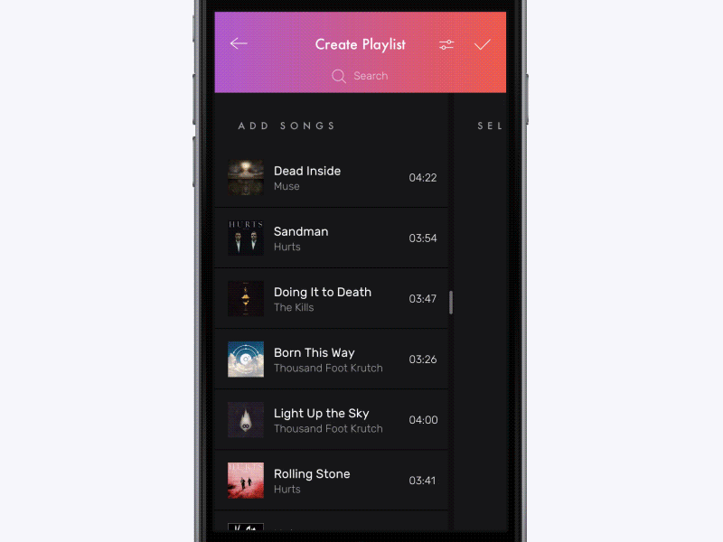

# Multi-Selection

[]()
[](https://jitpack.io/#yalantis/multi-selection)
[](https://yalantis.com/?utm_source=github)

[Live DEMO on appetize.io](https://appetize.io/app/ed1av4rv6k3f29y8e07kpj3e9g?device=nexus5&scale=75&orientation=portrait&osVersion=7.0)

<a href="https://play.google.com/store/apps/details?id=com.yalantis.multiselect.demo"></a>

Check this [project on dribbble](https://dribbble.com/shots/2904577-Multi-Selection-Experiment)

Read how we did it [on our blog](https://yalantis.com/blog/how-we-created-a-multiselection-solution-for-android/)



##Requirements
- Android SDK 17+

##Usage

Add to your root build.gradle:
```Groovy
allprojects {
	repositories {
	...
	maven { url "https://jitpack.io" }
	}
}
```

Add the dependency:
```Groovy
dependencies {
	        compile 'com.github.yalantis:multi-selection:v0.1'
}
```

## How to use this library

Instructions can be found [here](https://yalantis.com/blog/how-we-created-a-multiselection-solution-for-android/) in section How to use MultiSelect

## Let us know!

We’d be really happy if you sent us links to your projects where you use our component. Just send an email to github@yalantis.com And do let us know if you have any questions or suggestion regarding the animation. 

P.S. We’re going to publish more awesomeness wrapped in code and a tutorial on how to make UI for iOS (Android) better than better. Stay tuned!

## License

	The MIT License (MIT), Yalantis, https://yalantis.com
  Please see the LICENSE file

